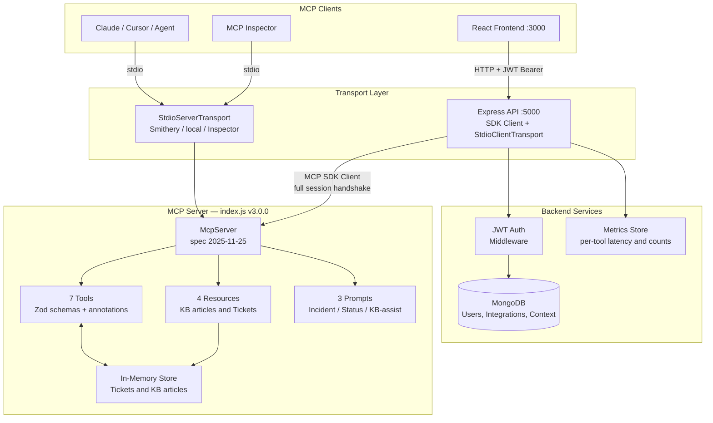
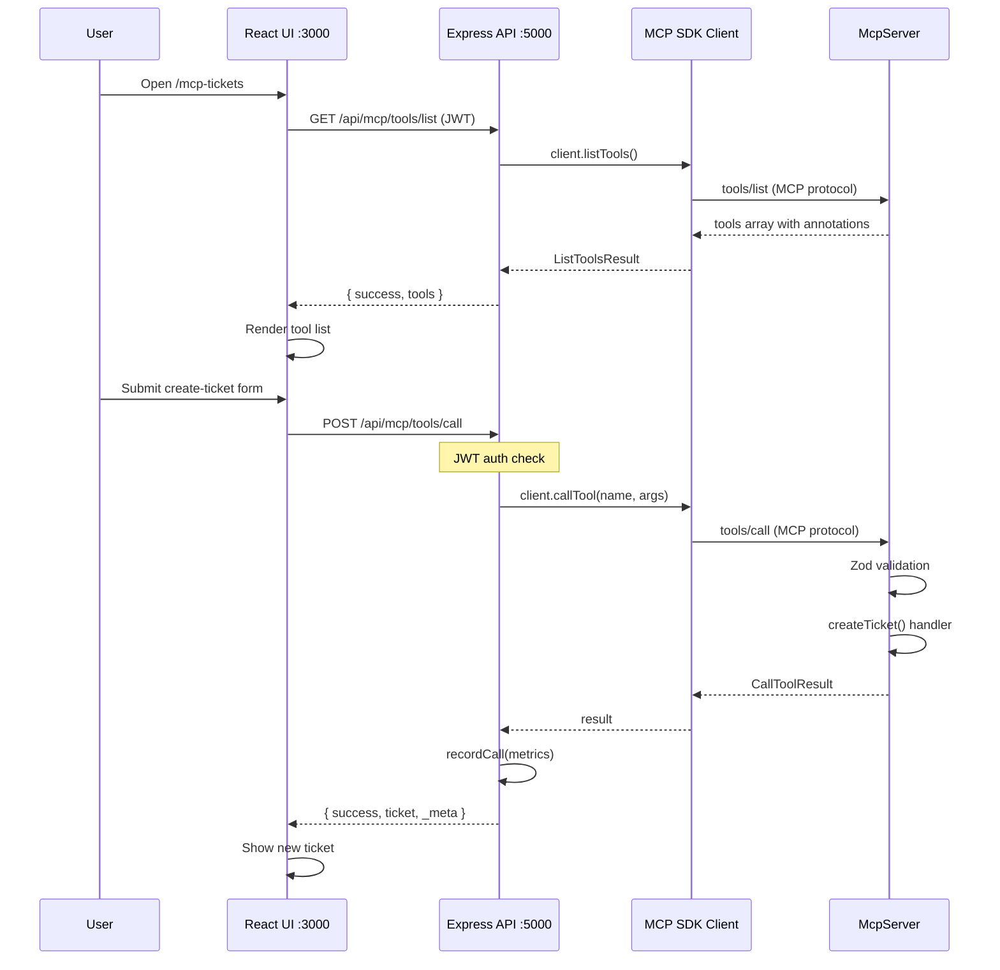
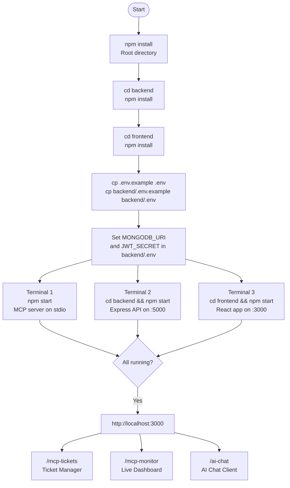
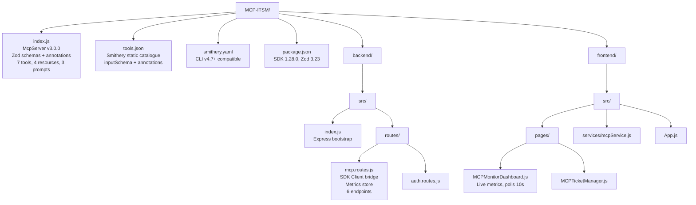
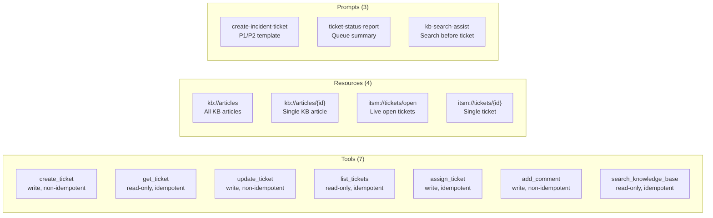

# MCP ITSM — Architecture Diagrams

> Last updated: May 2026 · Spec 2025-11-25 · SDK 1.28.0

---

## System Architecture

---

## Browser Request Flow

---

## Startup Flow

---

## File Structure

---

## MCP Capabilities Map

