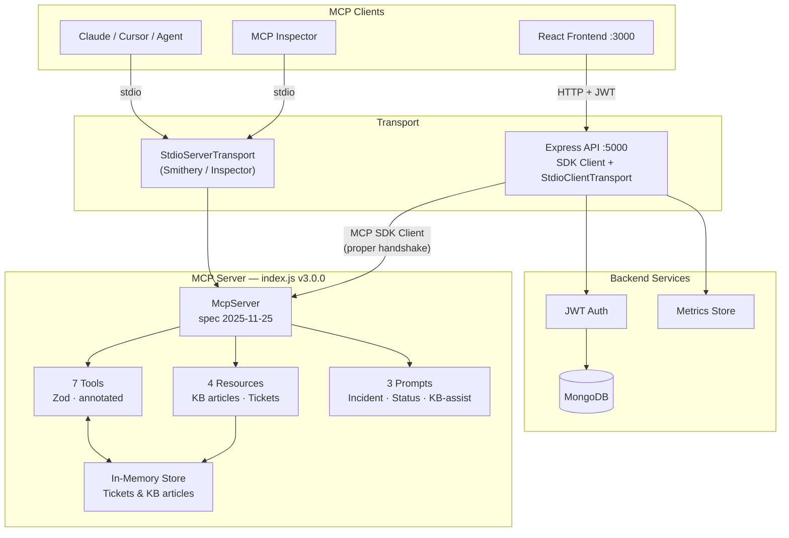
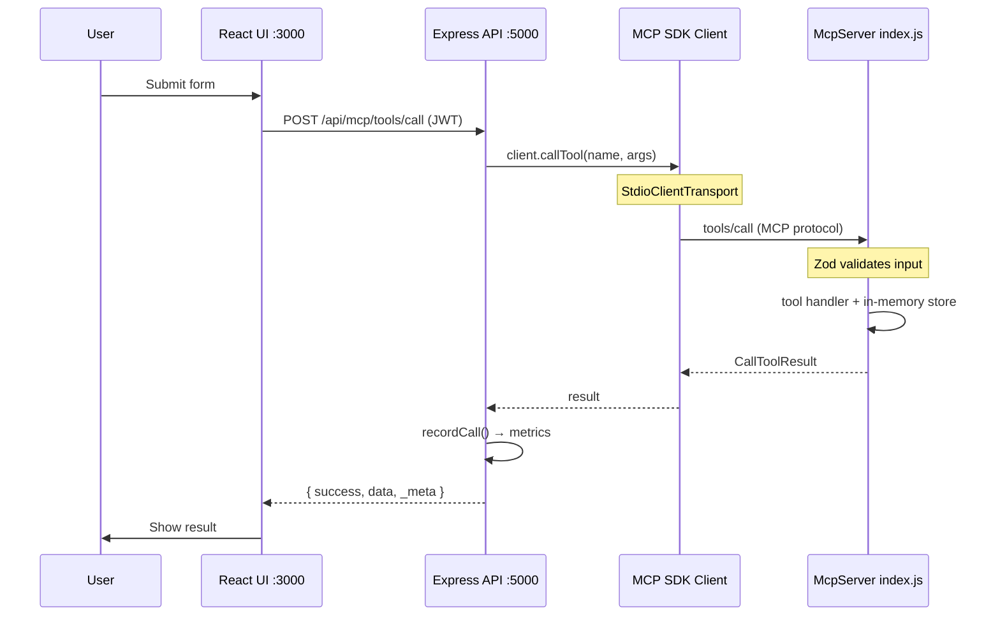
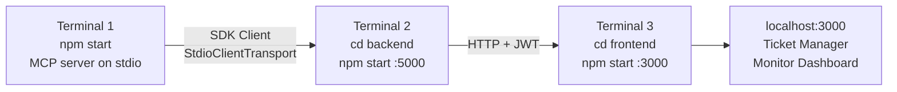
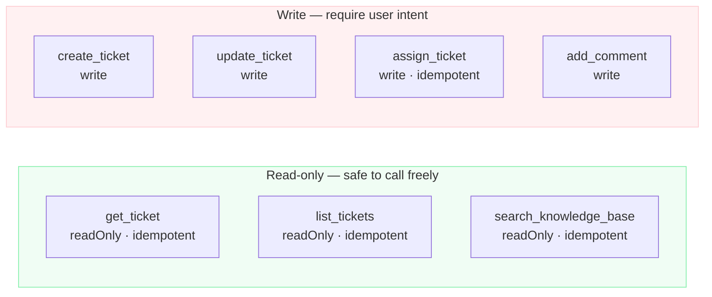
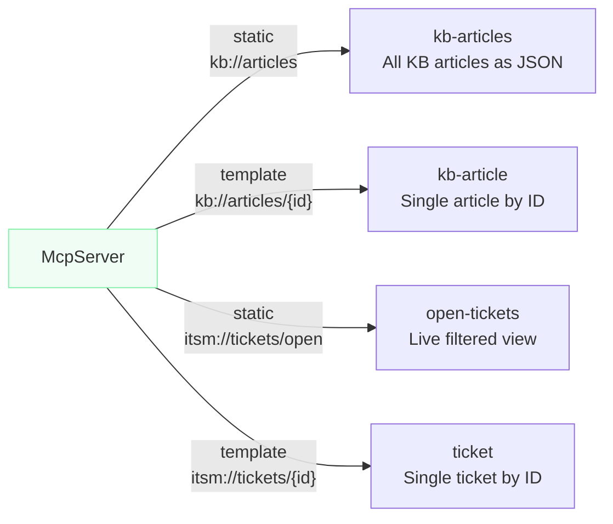
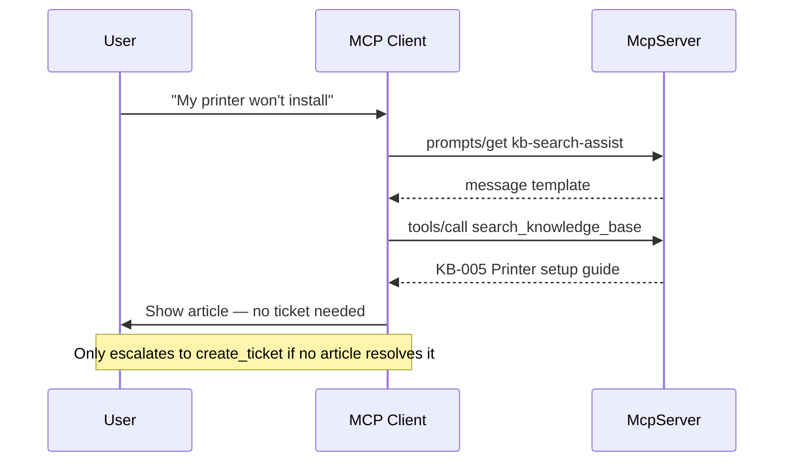
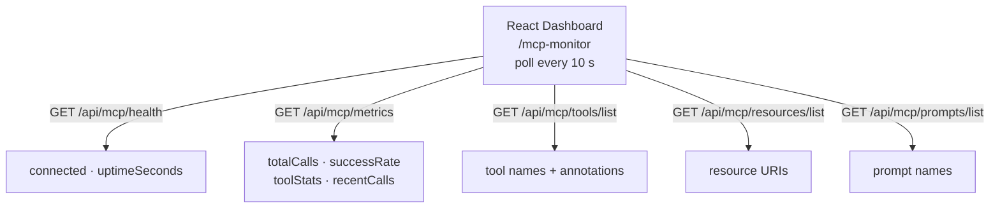
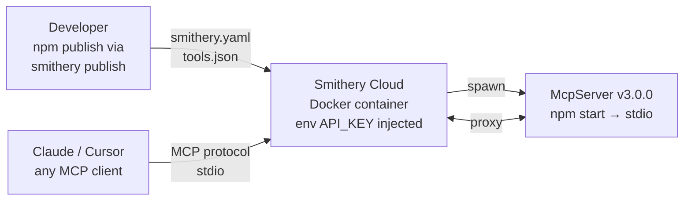
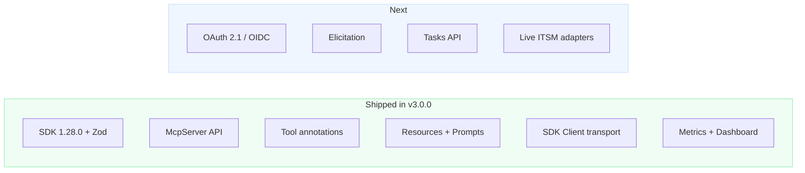

# MCP ITSM

> Unified IT Service Management over the **Model Context Protocol** — create, track, and resolve tickets across ServiceNow, Jira, Zendesk, Ivanti Neurons, and Cherwell from any MCP-compatible LLM client.

[](https://modelcontextprotocol.io/specification/2025-11-25)
[](https://www.npmjs.com/package/@modelcontextprotocol/sdk)
[](https://nodejs.org)
[](LICENSE)
[](https://smithery.ai/server/@madosh/mcp-itsm)
<a href="https://glama.ai/mcp/servers/hud80wep9g"></a>

---

## Table of Contents

- [Overview](#overview)
- [Architecture](#architecture)
- [Quick Start](#quick-start)
- [Project Structure](#project-structure)
- [MCP Tools](#mcp-tools)
- [MCP Resources](#mcp-resources)
- [MCP Prompts](#mcp-prompts)
- [Configuration](#configuration)
- [Monitoring Dashboard](#monitoring-dashboard)
- [API Reference](#api-reference)
- [Smithery Deployment](#smithery-deployment)
- [Development](#development)
- [Contributing](#contributing)
- [License](#license)

---

## Overview

MCP ITSM exposes a standardised set of **MCP tools, resources, and prompts** so that any LLM client (Claude, Cursor, custom agents) can manage IT tickets without knowing the underlying ITSM system's API.

**What it is:**

| Layer | What's here |
|---|---|
| `index.js` | MCP server — 7 tools, 4 resources, 3 prompts over stdio |
| `backend/` | Express REST API that bridges HTTP clients to the MCP server via the official SDK `Client` |
| `frontend/` | React 18 web app — Ticket Manager UI + live Monitoring Dashboard |

**Why it matters:**  
Instead of writing separate integrations for ServiceNow, Jira, Zendesk, Ivanti, and Cherwell, an LLM calls `create_ticket` once and the correct system receives it. Every tool carries **safety annotations** (`readOnlyHint`, `destructiveHint`) so the model knows what it can call without risk.

---

## Architecture



**Request flow — browser tool call:**



---

## Quick Start

### Prerequisites

- **Node.js ≥ 18**
- **MongoDB** (local or Atlas — required by the backend)
- Optional: [Smithery CLI](https://smithery.ai/docs/concepts/cli) for cloud deployment

### 1 — Install dependencies

```bash
# Root (MCP server)
npm install

# Backend API
cd backend && npm install && cd ..

# Frontend
cd frontend && npm install && cd ..
```

### 2 — Configure environment

```bash
cp .env.example .env          # root — API key for Smithery / MCP auth
cp backend/.env.example backend/.env   # backend — Mongo URI, JWT secret, ITSM creds
```

Minimum required for local dev (edit `backend/.env`):

```env
MONGODB_URI=mongodb://localhost:27017/mcp-itsm
JWT_SECRET=change-me-in-production
```

### 3 — Start all services

Open three terminals:

```bash
# Terminal 1 — MCP server (stdio)
npm start

# Terminal 2 — Backend API
cd backend && npm start        # http://localhost:5000

# Terminal 3 — Frontend
cd frontend && npm start       # http://localhost:3000
```



### Access points

| URL | What |
|---|---|
| `http://localhost:3000` | React web app |
| `http://localhost:3000/mcp-tickets` | MCP Ticket Manager |
| `http://localhost:3000/mcp-monitor` | Live Monitoring Dashboard |
| `http://localhost:5000/health` | Backend health check |
| `http://localhost:5000/api/mcp/health` | MCP server connectivity |
| `http://localhost:5000/api/mcp/metrics` | Tool-call metrics (auth required) |

---

## Project Structure

```
mcp-itsm/
├── index.js                  # MCP server (McpServer, Zod, stdio)
├── tools.json                # Static tool catalogue for Smithery browser
├── smithery.yaml             # Smithery deployment config
├── package.json              # Root deps: @modelcontextprotocol/sdk, zod
├── .env.example              # Root env template
│
├── backend/
│   ├── package.json          # Express, Mongoose, JWT, MCP SDK Client
│   ├── .env.example          # Backend env template
│   └── src/
│       ├── index.js          # Express app bootstrap
│       ├── config/config.js  # Env-driven configuration
│       ├── routes/
│       │   ├── mcp.routes.js      # MCP bridge + metrics endpoints
│       │   ├── auth.routes.js
│       │   ├── context.routes.js
│       │   ├── integration.routes.js
│       │   └── user.routes.js
│       ├── middleware/
│       │   ├── auth.middleware.js
│       │   └── validation.middleware.js
│       ├── models/
│       ├── validators/
│       └── utils/logger.js
│
├── frontend/
│   ├── package.json          # React 18, Bootstrap, react-router-dom
│   └── src/
│       ├── App.js
│       ├── pages/
│       │   ├── MCPTicketManager.js     # Ticket CRUD UI
│       │   ├── MCPMonitorDashboard.js  # Live monitoring (polls every 10s)
│       │   ├── Dashboard.js
│       │   ├── LLMChatClient.js
│       │   └── ...
│       ├── services/
│       │   ├── mcpService.js   # HTTP client for MCP tool calls
│       │   └── api.js          # Axios instance with JWT interceptor
│       └── components/
│           ├── Header.js
│           └── ...
│
└── docs/
    ├── api-documentation.md
    ├── mcp_relationship.md
    └── llm_enabled_tickets.md
```

---

## MCP Tools

All 7 tools are registered via `McpServer.tool()` with **Zod input schemas** and **safety annotations**. LLM clients use the annotations to decide whether to call a tool without user confirmation.

| Tool | Title | Read-only | Idempotent | Required params |
|---|---|:---:|:---:|---|
| `create_ticket` | Create Ticket | — | — | `title`, `description` |
| `get_ticket` | Get Ticket | ✓ | ✓ | `ticket_id` |
| `update_ticket` | Update Ticket | — | — | `ticket_id` |
| `list_tickets` | List Tickets | ✓ | ✓ | — |
| `assign_ticket` | Assign Ticket | — | ✓ | `ticket_id`, `user_id` |
| `add_comment` | Add Comment | — | — | `ticket_id`, `comment` |
| `search_knowledge_base` | Search KB | ✓ | ✓ | `query` |

**Supported systems** (via the optional `system` parameter): `servicenow` · `jira` · `zendesk` · `ivanti_neurons` · `cherwell` (default: `jira`)



### Example — create a ticket

```json
// Tool call
{
  "name": "create_ticket",
  "arguments": {
    "title": "VPN not connecting after Windows update",
    "description": "Since the KB5034441 update, VPN client fails to authenticate on first attempt.",
    "priority": "high",
    "system": "jira"
  }
}

// Response
{
  "success": true,
  "ticket": {
    "id": "JIRA-1000",
    "title": "VPN not connecting after Windows update",
    "system": "jira",
    "status": "open",
    "priority": "high",
    "url": "https://example.com/jira/tickets/JIRA-1000"
  }
}
```

---

## MCP Resources

Resources expose live data that LLM clients can read without a tool call.

| URI | Name | Description |
|---|---|---|
| `kb://articles` | kb-articles | All knowledge base articles (JSON) |
| `kb://articles/{id}` | kb-article | Single KB article by ID (e.g. `KB-001`) |
| `itsm://tickets/open` | open-tickets | All currently open tickets (live) |
| `itsm://tickets/{ticketId}` | ticket | Single ticket by ID (e.g. `JIRA-1000`) |



---

## MCP Prompts

Prompts are guided message templates that clients present to users before a tool call sequence.

| Name | Description | Arguments |
|---|---|---|
| `create-incident-ticket` | P1/P2 incident ticket template | `title` (req), `system`, `affected_service` |
| `ticket-status-report` | Structured queue summary | `filter_status` |
| `kb-search-assist` | Search KB before creating a ticket | `issue_description` (req) |



---

## Configuration

### Root `.env` (MCP server + Smithery)

```env
# API key used when running via Smithery (injected as API_KEY env var)
API_KEY=your-smithery-api-key
```

### Backend `backend/.env`

```env
# Server
PORT=5000
NODE_ENV=development

# Database
MONGODB_URI=mongodb://localhost:27017/mcp-itsm

# Auth
JWT_SECRET=change-me-to-a-long-random-string
JWT_EXPIRES_IN=1d

# ITSM integrations (all optional — only needed for live system calls)
SERVICENOW_BASE_URL=https://your-instance.service-now.com
SERVICENOW_USERNAME=admin
SERVICENOW_PASSWORD=

JIRA_BASE_URL=https://your-org.atlassian.net
JIRA_EMAIL=you@example.com
JIRA_API_TOKEN=

ZENDESK_BASE_URL=https://your-org.zendesk.com
ZENDESK_USERNAME=you@example.com
ZENDESK_TOKEN=

IVANTI_BASE_URL=https://your-instance.ivanti.com
IVANTI_CLIENT_ID=
IVANTI_CLIENT_SECRET=

CHERWELL_BASE_URL=https://your-instance.cherwell.com
CHERWELL_CLIENT_ID=
CHERWELL_USERNAME=
CHERWELL_PASSWORD=

# Logging
LOG_LEVEL=info
```

---

## Monitoring Dashboard

The frontend includes a live monitoring dashboard at `/mcp-monitor` that polls the backend every **10 seconds**.

**What it shows:**

- Server connected / disconnected status with uptime
- Total calls, success rate, failed call count
- Per-tool call statistics with average latency badges
- Available tools with annotation labels (read-only, write, idempotent)
- Registered resources and prompts
- Live activity log of the last 20 tool calls

The data is sourced from the in-memory metrics store in `backend/src/routes/mcp.routes.js` and reset on backend restart.



---

## API Reference

All `/api/mcp/*` endpoints require a valid JWT in the `Authorization: Bearer <token>` header.

| Method | Path | Description |
|---|---|---|
| `GET` | `/api/mcp/health` | MCP server connectivity + backend uptime |
| `GET` | `/api/mcp/metrics` | Tool-call metrics (counts, latency, recent calls) |
| `GET` | `/api/mcp/tools/list` | List all registered tools with schemas + annotations |
| `POST` | `/api/mcp/tools/call` | Call a tool — body: `{ name, arguments }` |
| `GET` | `/api/mcp/resources/list` | List registered MCP resources |
| `GET` | `/api/mcp/prompts/list` | List registered MCP prompts |

### Tool call example (curl)

```bash
# Authenticate first
TOKEN=$(curl -s -X POST http://localhost:5000/api/auth/login \
  -H "Content-Type: application/json" \
  -d '{"email":"admin@example.com","password":"password"}' | jq -r '.token')

# Call a tool
curl -X POST http://localhost:5000/api/mcp/tools/call \
  -H "Authorization: Bearer $TOKEN" \
  -H "Content-Type: application/json" \
  -d '{
    "name": "search_knowledge_base",
    "arguments": { "query": "vpn", "limit": 3 }
  }'
```

---

## Smithery Deployment

The server is published at **[@madosh/mcp-itsm](https://smithery.ai/server/@madosh/mcp-itsm)** on Smithery.



### Install via Smithery CLI

```bash
npx -y @smithery/cli install @madosh/mcp-itsm --client claude
```

### Manual Smithery deploy

```bash
npm install -g @smithery/cli
smithery login
smithery publish
```

The `smithery.yaml` configuration:

```yaml
startCommand:
  type: stdio
  configSchema:
    type: object
    required: [apiKey]
    properties:
      apiKey:
        type: string
  commandFunction: |-
    (config) => ({ command: 'npm', args: ['start'], env: { API_KEY: config.apiKey } })
tools:
  path: ./tools.json
```

### Use with Claude Desktop

Add to `claude_desktop_config.json`:

```json
{
  "mcpServers": {
    "mcp-itsm": {
      "command": "node",
      "args": ["/absolute/path/to/mcp-itsm/index.js"],
      "env": { "API_KEY": "your-key" }
    }
  }
}
```

### Debug with MCP Inspector

```bash
npm run debug-mcp
# Opens MCP Inspector at http://localhost:5173
```

---

## Development

### Available scripts

```bash
# Root
npm start              # Start MCP server on stdio
npm run debug-mcp      # Start with MCP Inspector attached

# Backend
cd backend
npm start              # Production
npm run dev            # Development (nodemon hot-reload)
npm test               # Jest test suite

# Frontend
cd frontend
npm start              # Dev server on :3000
npm run build          # Production build
```

### Tech stack

| Layer | Technologies |
|---|---|
| MCP Server | Node.js 18+, `@modelcontextprotocol/sdk` 1.28.0, Zod 3.23 |
| Backend | Express 4, Mongoose 7, JWT, Helmet, Winston |
| Frontend | React 18, React Router 6, Bootstrap 5 |
| MCP Spec | [2025-11-25](https://modelcontextprotocol.io/specification/2025-11-25) |
| Deployment | Smithery (stdio), Docker |

### Running with Docker

```bash
docker build -t mcp-itsm .
docker run -e API_KEY=your-key mcp-itsm
```

---

## Contributing

Contributions are welcome. Please:

1. Fork the repository
2. Create a feature branch (`git checkout -b feat/my-feature`)
3. Commit your changes (`git commit -m 'feat: add my feature'`)
4. Push to the branch (`git push origin feat/my-feature`)
5. Open a Pull Request

### Roadmap

- [ ] OAuth 2.1 / OIDC authorization for external clients
- [ ] Elicitation — server-initiated mid-call user prompts
- [ ] Experimental Tasks — durable async ticket workflows
- [ ] Live ITSM system adapters (ServiceNow, Jira, Zendesk)
- [ ] `outputSchema` / `structuredContent` on all tools



---

## License

MIT — see [LICENSE](LICENSE) for details.

---

## Resources

- [Model Context Protocol](https://modelcontextprotocol.io)
- [MCP Spec 2025-11-25](https://modelcontextprotocol.io/specification/2025-11-25)
- [Smithery Documentation](https://smithery.ai/docs)
- [MCP TypeScript SDK](https://github.com/modelcontextprotocol/typescript-sdk)
