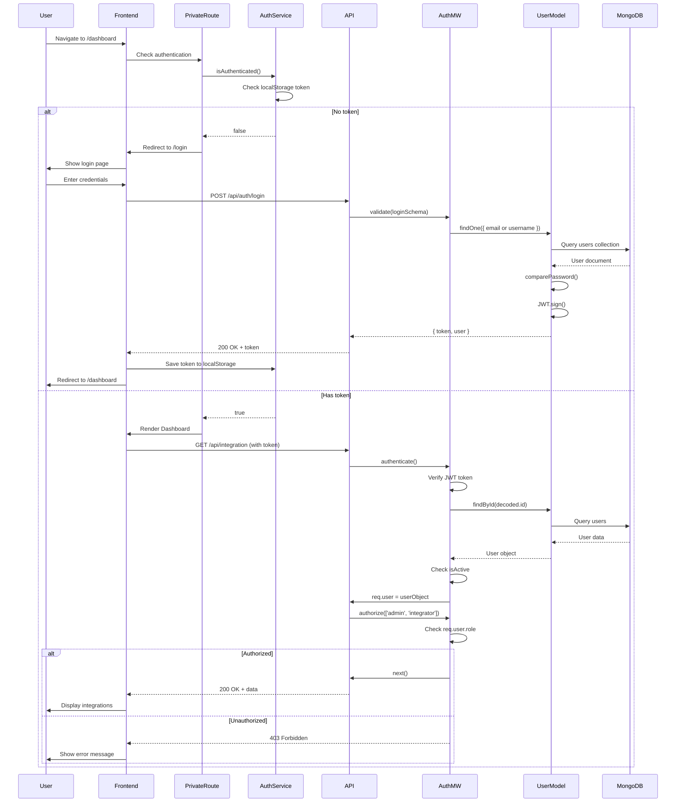
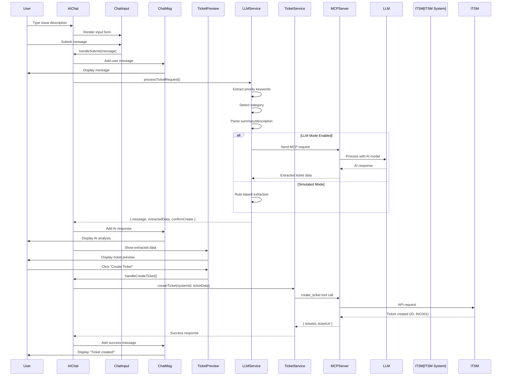
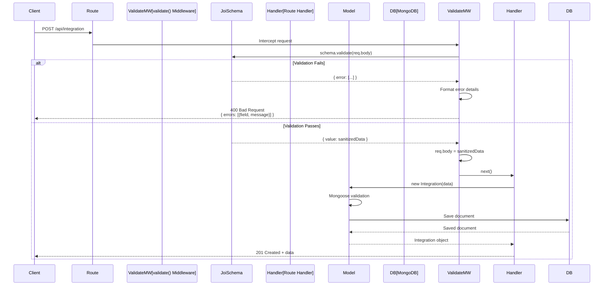
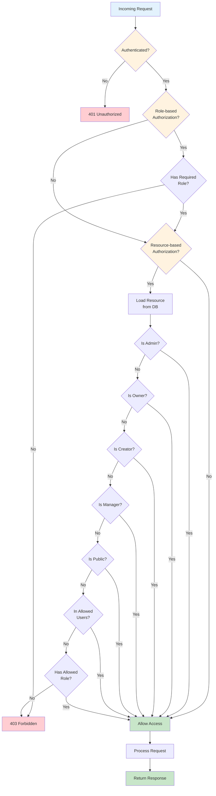
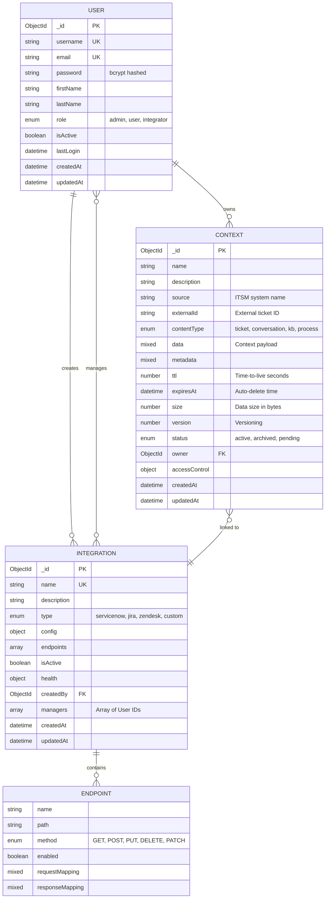
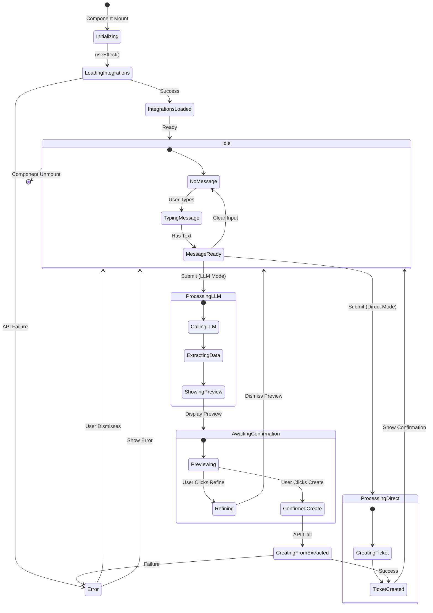
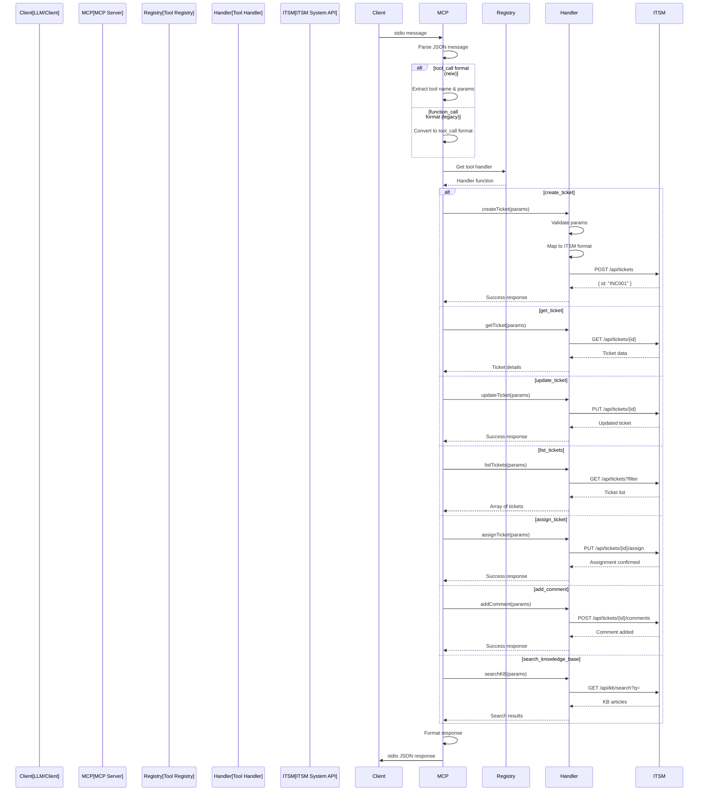
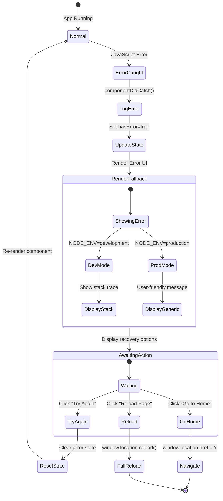
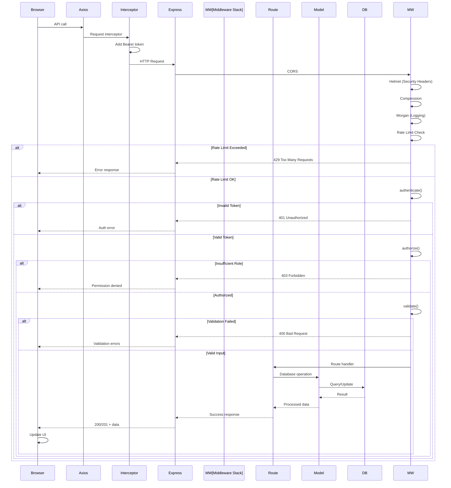
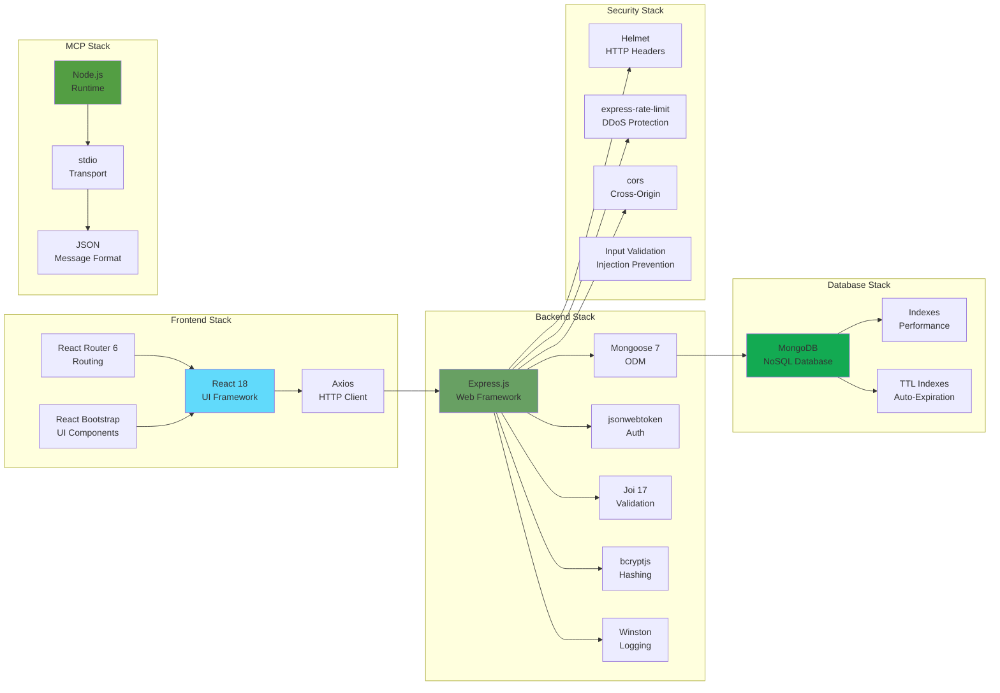

# MCP-ITSM System Architecture

## Overview Diagram

```mermaid
graph TB
    subgraph "External Systems"
        LLM[LLM/Claude API<br/>AI Processing]
        SN[ServiceNow<br/>ITSM Platform]
        JIRA[Jira<br/>ITSM Platform]
        ZD[Zendesk<br/>ITSM Platform]
    end

    subgraph "Frontend Layer - React SPA"
        Browser[User Browser]

        subgraph "App Shell"
            EB[ErrorBoundary<br/>Global Error Handler]
            Router[React Router]
            Header[Header Component]
            Footer[Footer Component]
        end

        subgraph "Pages"
            Login[Login Page]
            Dashboard[Dashboard<br/>Integration Overview]
            AIChat[LLMChatClient<br/>AI-Assisted Chat]
            IntList[Integrations List]
            IntDetail[Integration Detail]
            Profile[User Profile]
            UserMgmt[User Management<br/>Admin Only]
        end

        subgraph "Chat Components"
            ChatMsg[ChatMessageList]
            ChatInput[ChatInputForm]
            TicketPreview[TicketPreviewPanel]
        end

        subgraph "Custom Hooks"
            UseChatHistory[useChatHistory<br/>Message State]
            UseContext[useConversationContext<br/>MCP Context State]
        end

        subgraph "Services"
            AuthSvc[authService<br/>Login/Logout/Token]
            IntSvc[integrationService<br/>CRUD Operations]
            UserSvc[userService<br/>User Management]
            LLMSvc[llmService<br/>AI Processing]
            TicketSvc[ticketService<br/>Ticket Operations]
        end

        subgraph "Guards"
            PrivateRoute[PrivateRoute<br/>Auth Guard]
        end
    end

    subgraph "Backend Layer - Express.js API"
        API[Express Server<br/>Port 5000]

        subgraph "Middleware Stack"
            CORS[CORS<br/>Cross-Origin]
            Helmet[Helmet<br/>Security Headers]
            Compression[Compression<br/>gzip]
            Morgan[Morgan<br/>HTTP Logging]
            RateLimit[Rate Limiter<br/>DDoS Protection]
            AuthMW[authenticate()<br/>JWT Verification]
            AuthzMW[authorize()<br/>Role Check]
            ValMW[validate()<br/>Joi Schema]
        end

        subgraph "Route Handlers"
            AuthRoutes[Auth Routes<br/>/api/auth]
            ContextRoutes[Context Routes<br/>/api/context]
            IntRoutes[Integration Routes<br/>/api/integration]
            UserRoutes[User Routes<br/>/api/users]
            HealthRoutes[Health Check<br/>/health]
        end

        subgraph "Validators"
            AuthVal[authValidator<br/>login/register schemas]
            CtxVal[contextValidator<br/>CRUD schemas]
            IntVal[integrationValidator<br/>CRUD schemas]
        end

        subgraph "Models - Mongoose ODM"
            UserModel[User Model<br/>Credentials/Roles]
            CtxModel[Context Model<br/>MCP Context Storage]
            IntModel[Integration Model<br/>ITSM Configs]
        end

        subgraph "Utils"
            Logger[Winston Logger<br/>Structured Logging]
            Config[Configuration<br/>Environment Variables]
        end
    end

    subgraph "Database Layer"
        MongoDB[(MongoDB<br/>Document Store)]

        subgraph "Collections"
            UsersCol[users<br/>Authentication Data]
            ContextCol[contexts<br/>MCP Context Data]
            IntCol[integrations<br/>ITSM Configurations]
        end
    end

    subgraph "MCP Server Layer"
        MCPServer[MCP Server<br/>index.js]

        subgraph "MCP Protocol"
            StdIO[stdio Transport<br/>JSON Messages]
            ToolRegistry[Tool Registry<br/>7 ITSM Tools]
        end

        subgraph "MCP Tools"
            CreateTicket[create_ticket<br/>Create new tickets]
            GetTicket[get_ticket<br/>Retrieve ticket]
            UpdateTicket[update_ticket<br/>Modify ticket]
            ListTickets[list_tickets<br/>Query tickets]
            AssignTicket[assign_ticket<br/>Assign to user]
            AddComment[add_comment<br/>Add comments]
            SearchKB[search_knowledge_base<br/>KB articles]
        end
    end

    %% Frontend Connections
    Browser --> EB
    EB --> Router
    Router --> Header
    Router --> Footer
    Router --> Login
    Router --> Dashboard
    Router --> AIChat
    Router --> IntList
    Router --> IntDetail
    Router --> Profile
    Router --> UserMgmt

    AIChat --> ChatMsg
    AIChat --> ChatInput
    AIChat --> TicketPreview
    AIChat --> UseChatHistory
    AIChat --> UseContext

    Dashboard --> IntSvc
    AIChat --> LLMSvc
    AIChat --> TicketSvc
    AIChat --> IntSvc
    Login --> AuthSvc
    IntList --> IntSvc
    IntDetail --> IntSvc
    Profile --> UserSvc
    UserMgmt --> UserSvc

    PrivateRoute --> AuthSvc
    Router --> PrivateRoute

    %% Service to Backend
    AuthSvc -.HTTP.-> API
    IntSvc -.HTTP.-> API
    UserSvc -.HTTP.-> API
    LLMSvc -.HTTP.-> API
    TicketSvc -.HTTP.-> API

    %% Backend Middleware Flow
    API --> CORS
    CORS --> Helmet
    Helmet --> Compression
    Compression --> Morgan
    Morgan --> RateLimit
    RateLimit --> AuthMW
    AuthMW --> AuthzMW
    AuthzMW --> ValMW

    %% Routes and Validators
    ValMW --> AuthRoutes
    ValMW --> ContextRoutes
    ValMW --> IntRoutes
    ValMW --> UserRoutes
    ValMW --> HealthRoutes

    AuthRoutes --> AuthVal
    ContextRoutes --> CtxVal
    IntRoutes --> IntVal

    %% Models
    AuthRoutes --> UserModel
    ContextRoutes --> CtxModel
    IntRoutes --> IntModel
    UserRoutes --> UserModel

    %% Utils
    AuthRoutes --> Logger
    ContextRoutes --> Logger
    IntRoutes --> Logger
    UserRoutes --> Logger
    AuthRoutes --> Config

    %% Database
    UserModel --> MongoDB
    CtxModel --> MongoDB
    IntModel --> MongoDB
    MongoDB --> UsersCol
    MongoDB --> ContextCol
    MongoDB --> IntCol

    %% MCP Server
    LLMSvc -.MCP Protocol.-> MCPServer
    MCPServer --> StdIO
    MCPServer --> ToolRegistry
    ToolRegistry --> CreateTicket
    ToolRegistry --> GetTicket
    ToolRegistry --> UpdateTicket
    ToolRegistry --> ListTickets
    ToolRegistry --> AssignTicket
    ToolRegistry --> AddComment
    ToolRegistry --> SearchKB

    %% External Integrations
    CreateTicket -.API.-> SN
    CreateTicket -.API.-> JIRA
    CreateTicket -.API.-> ZD
    GetTicket -.API.-> SN
    GetTicket -.API.-> JIRA
    GetTicket -.API.-> ZD
    LLMSvc -.API.-> LLM

    %% Styling
    classDef frontend fill:#e1f5ff,stroke:#01579b,stroke-width:2px
    classDef backend fill:#fff3e0,stroke:#e65100,stroke-width:2px
    classDef database fill:#f1f8e9,stroke:#33691e,stroke-width:2px
    classDef mcp fill:#fce4ec,stroke:#880e4f,stroke-width:2px
    classDef external fill:#f3e5f5,stroke:#4a148c,stroke-width:2px

    class Browser,EB,Router,Header,Footer,Login,Dashboard,AIChat,IntList,IntDetail,Profile,UserMgmt,ChatMsg,ChatInput,TicketPreview,UseChatHistory,UseContext,AuthSvc,IntSvc,UserSvc,LLMSvc,TicketSvc,PrivateRoute frontend
    class API,CORS,Helmet,Compression,Morgan,RateLimit,AuthMW,AuthzMW,ValMW,AuthRoutes,ContextRoutes,IntRoutes,UserRoutes,HealthRoutes,AuthVal,CtxVal,IntVal,UserModel,CtxModel,IntModel,Logger,Config backend
    class MongoDB,UsersCol,ContextCol,IntCol database
    class MCPServer,StdIO,ToolRegistry,CreateTicket,GetTicket,UpdateTicket,ListTickets,AssignTicket,AddComment,SearchKB mcp
    class LLM,SN,JIRA,ZD external
```

---

## Authentication & Authorization Flow



---

## AI-Assisted Ticket Creation Flow



---

## Data Validation Flow



---

## Resource Access Control Flow



---

## Database Schema Relationships



---

## Component State Management



---

## MCP Server Tool Execution Flow



---

## Error Boundary Error Handling



---

## API Request/Response Cycle



---

## Technology Stack Overview



