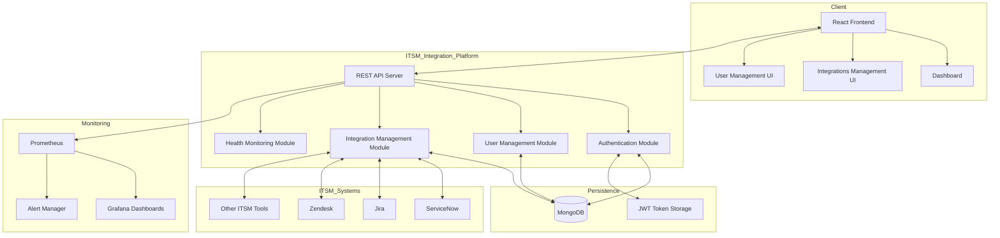
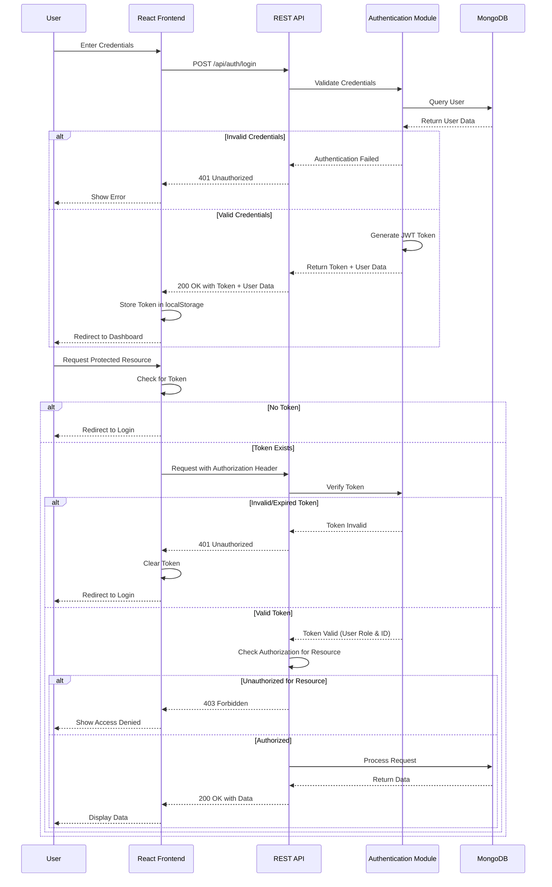
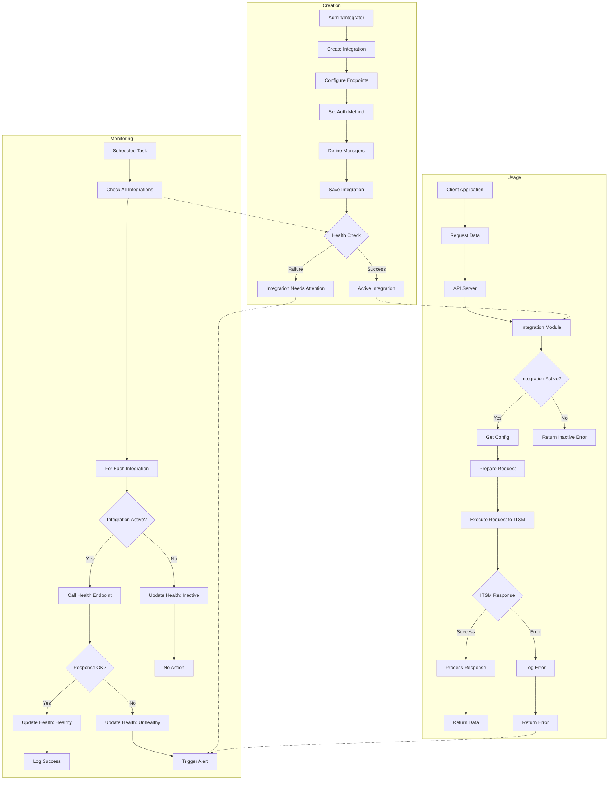
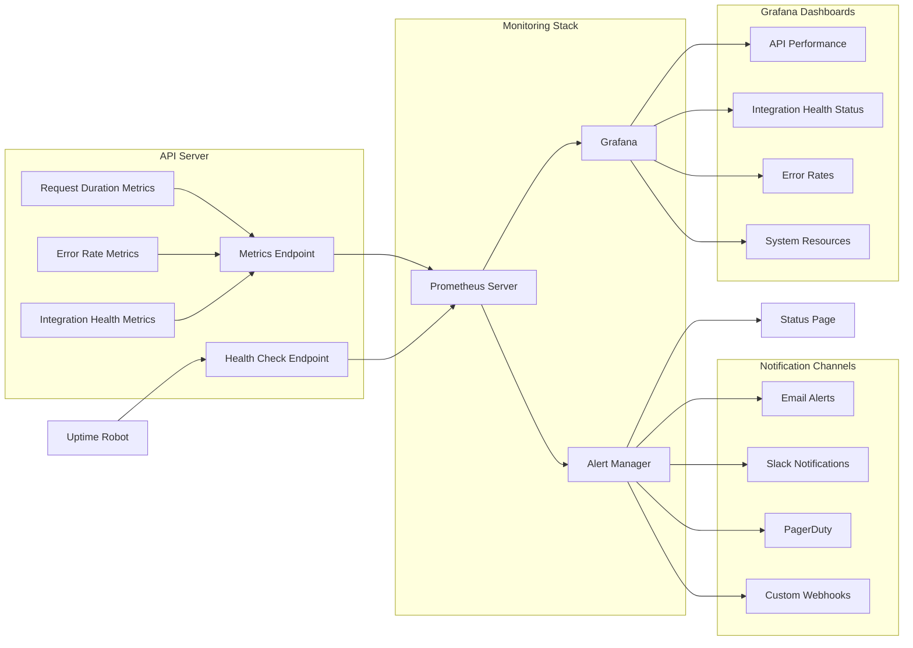
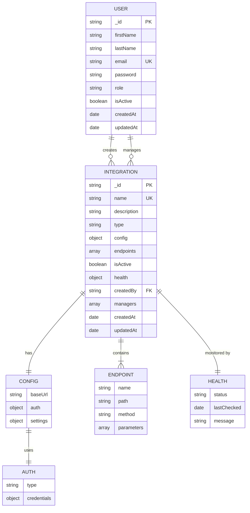

# ITSM Integration Platform Diagrams

This document renders all the Mermaid diagrams for the ITSM Integration Platform in one place for easy reference.

## System Architecture

## Authentication Flow

## Integration Workflow

## Monitoring Architecture

## Data Model

