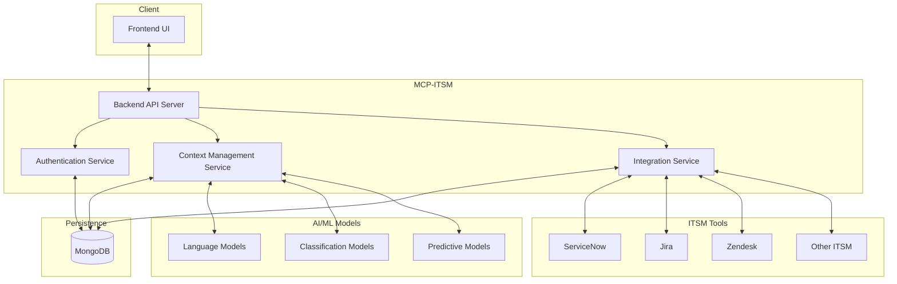
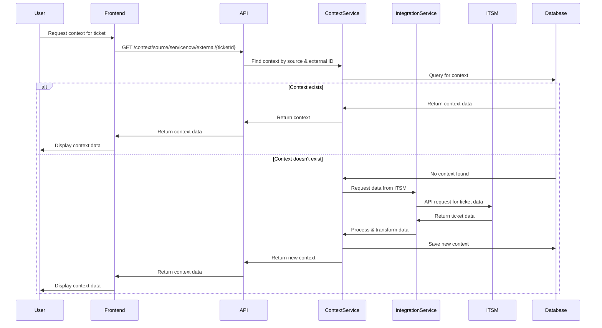
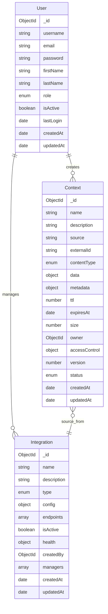
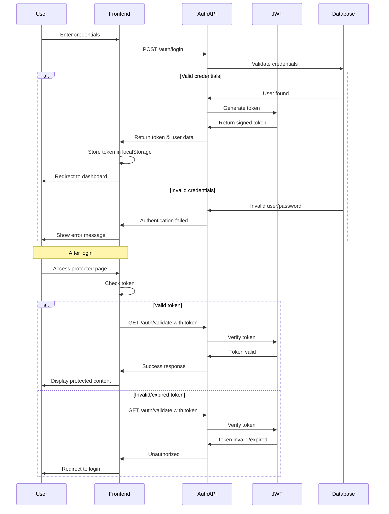
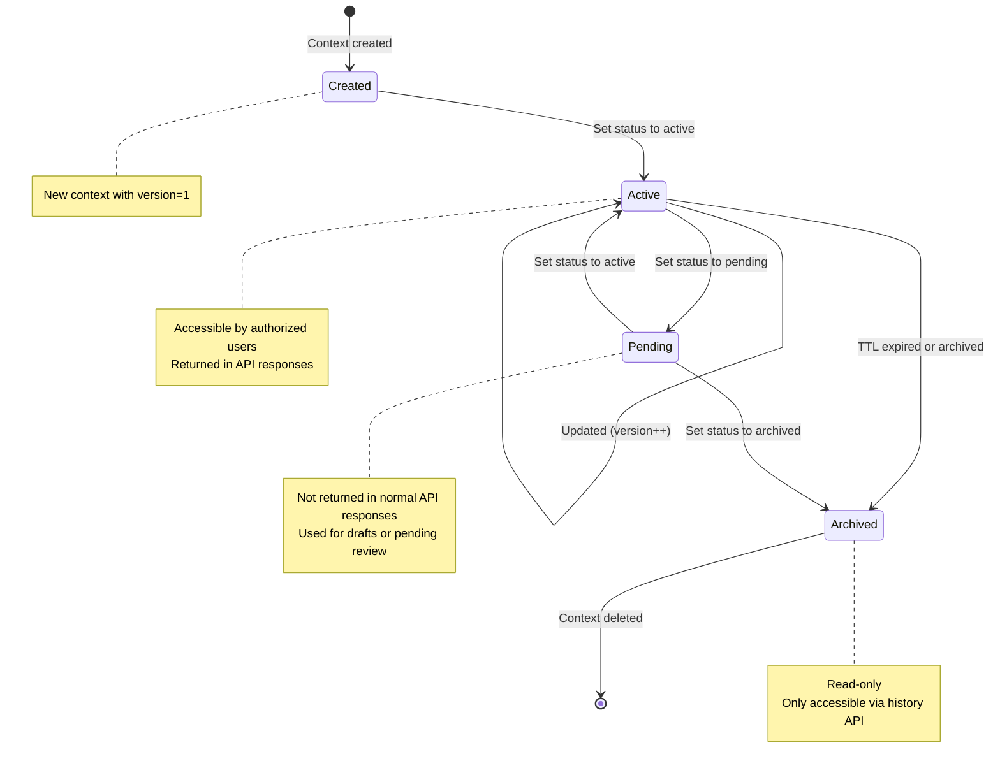
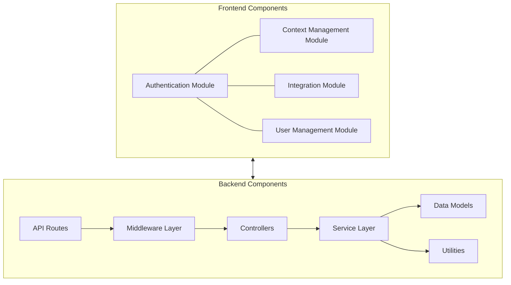

# MCP-ITSM System Diagrams

This file displays all the diagrams for the Model Context Protocol for ITSM integration.

## 1. System Architecture

## 2. Data Flow

## 3. Entity Relationship

## 4. Authentication Flow

## 5. Context Lifecycle

## 6. Component Architecture

